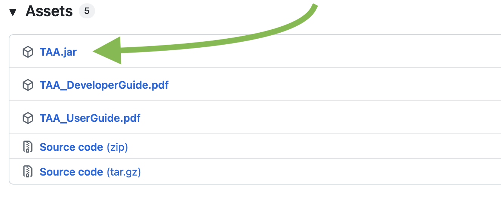
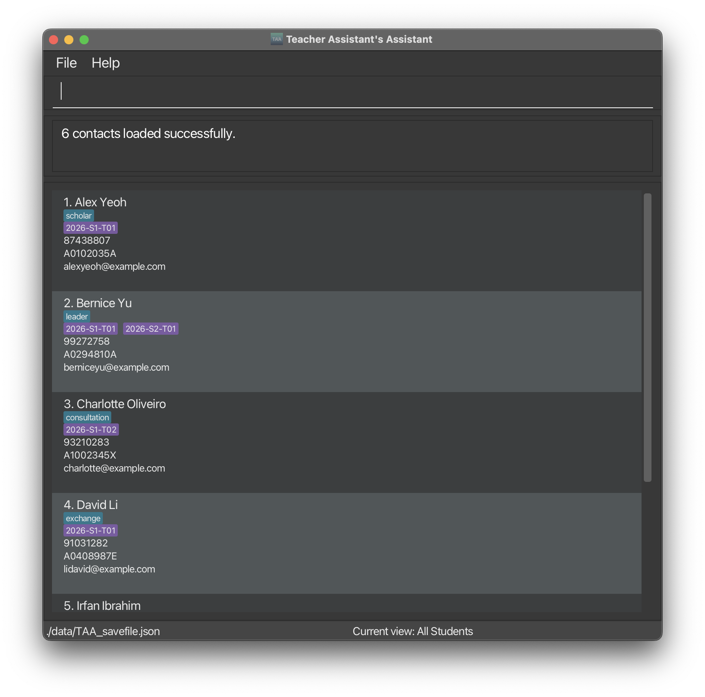
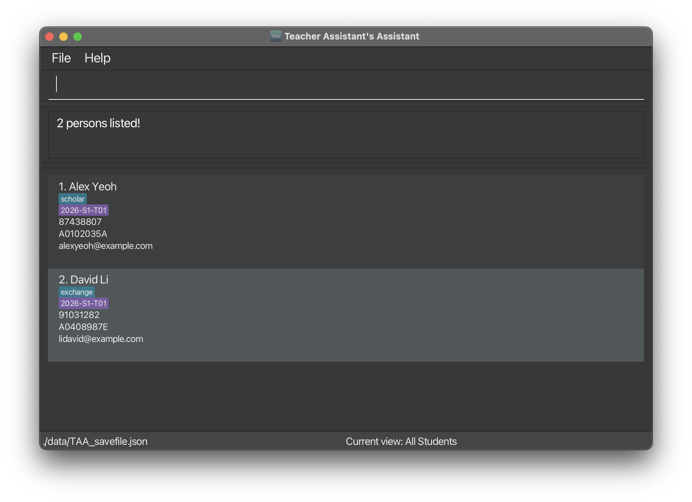
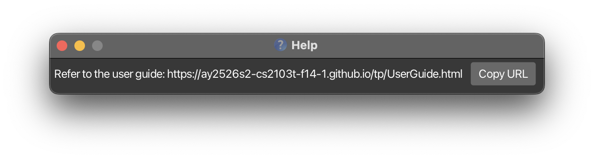

<div style="font-size: 2.5rem; font-weight: normal;">

TAA User Guide

</div>

Are you a NUS Teaching Assistant (TA) struggling to **keep track of your student's data** between spreadsheets and different apps? 
<br>Are you a TA that prefers **typing commands** over clicking through menus?

Look no further! Teacher Assistant's Assistant (TAA) is a **desktop app that consolidates all your student management needs in one place**. 
It leverages the speed of fast typists while maintaining a clean visual display, so you can manage students and track assignments, participation, and attendance — all without leaving your keyboard!

Spend less time organizing data and more time focusing on what matters most: **teaching**.

<!-- * Table of Contents -->
<page-nav-print />

<div style="page-break-after: always;"></div>

## Downloading and Launching the app

1. Ensure you have **Java 17** or above installed on your computer.<br>
 To install it or verify that you have the right version installed, you can refer to [this guide](https://se-education.org/guides/tutorials/javaInstallation.html).

<box type="info" light>

**macOS users:** Please ensure you have the exact Java version as stated [here](https://se-education.org/guides/tutorials/javaInstallationMac.html).

</box>

<br>

2. Download the latest version of the app (called `TAA.jar`) from [our GitHub page here](https://github.com/AY2526S2-CS2103T-F14-1/tp/releases/latest):

<a href="https://github.com/AY2526S2-CS2103T-F14-1/tp/releases/latest">
  
</a>

<br>

3. Move `TAA.jar` into a new folder used to contain the app's data. We recommend naming this folder "TAA App Folder" and putting it in your Downloads folder.

<br>

4. To launch TAA, open a command terminal and follow the instructions for your Operating System:

<panel header="**Windows**" type=seamless expanded>

1. Launch the **Terminal** app.
2. Navigate to the folder for "TAA App Folder" using the `cd` (change directory) command. <br>
For example, if you put `TAA.jar` in a folder named **TAA App Folder** in your **Downloads** folder, type the following and press enter:
```
cd "%USERPROFILE%\Downloads\TAA"
```
3. Launch the app. Type the following and press enter:
```
java -jar TAA.jar
```
</panel>

<panel header="**macOS** or **Linux**" type=seamless expanded>

1. Launch the **Terminal** app.
2. Navigate to the folder for "TAA App Folder" using the `cd` (change directory) command. <br>
   For example, if you put `TAA.jar` in a folder named **TAA App Folder** in your **Downloads** folder, type the following and press enter:
```
cd "~/Downloads/TAA"
```
3. Launch the app. Type the following and press enter:
```
java -jar TAA.jar
```

</panel>

<div style="page-break-after: always;"></div>

You should see TAA launch:
<p></p>


<box type="success" light>

Once TAA is running, you can start by learning about the app's [Core Concepts](#core-concepts) to understand what the app can do.
Then, continue onto the [Recommended Workflows](#recommended-workflows) how see how the app can fit into your workflows.

You can refer to the [Features](#feature-managing-students) section for detailed command documentation.

Finally, to clear all existing demo data and begin your use of TAA, run `clear`.

</box>

---

<div style="page-break-after: always;"></div>

## Core Concepts

Before diving into features, let's learn how TAA organises your data.

### Students vs Session Data

TAA manages **two types of information**:

* **Static information (per student):**
  * Name, phone, email, matric number, tags
  * Used for identifying and contacting students
* **Session-based information (per group, per date):**
  * Attendance
  * Participation
  * Assignment grades

👉 This means a student can have different attendance, participation, and grades across different groups and dates.

---

### Groups as Context

Most actions in TAA happen within a **group context**.

- You switch into a group using:
```
switchgroup g/GROUP_NAME
```
- Then perform actions like:
- `mark`, `unmark` (attendance)
- `part` (participation)
- `view` (session overview)
- `createassignment`, `gradeassignment`

👉 Think of it as: “I am currently working in this group.”

---

### Layouts Control What You See and Edit

TAA has different layouts:

- `list` → shows a list of students in the current group
- `view` → shows an overview of attendance and participation across sessions

👉 Important:
- Commands act on **what is currently displayed**
- Always check your **current group** before running commands (shown bottom right of the app)

---

### Index-based Operations

Many commands use `i/INDEX` or `i/INDEX_EXPRESSION`.

- Indexes change depending on your current group

👉 Tip: Run `list` or `view` before using index-based commands to avoid mistakes.

---

<div style="page-break-after: always;"></div>

## Recommended Workflows

Instead of memorising commands, you can follow these common workflows.

### Adding and organizing students

1. Add students:
```
add n/John Doe p/98765432 e/johnd@example.com m/A1234567X
```

2. Create a group:
```
creategroup g/2026-S1-T01
```

3. Add students to the group:
```
addtogroup g/2026-s1-t01 i/1-5
```
<box type="info" light>

Note how group names can be specified case-insensitively for convenience.

</box>

---

### Taking attendance for a class

1. Switch to the group:
```
switchgroup g/2026-s1-t01
```

2. Open or focus on a session:
```
view d/2026-03-16
```

3. Mark students as present:
```
mark i/1-10
```

4. Mark absentees:
```
unmark i/3
```

---

### Recording participation

After opening a session:

```
part i/1 pv/4
```

- Participation values range from 0 to 5

---

### Managing assignments

1. Create an assignment:
```
createassignment a/Quiz 1 d/2026-04-05 mm/20
```

<box type="info" light>

Type `createa` and press TAB on your keyboard to autocomplete commands. 

</box>

2. Grade students:
```
gradeassignment a/Quiz 1 i/1-5 gr/18
```

---

### Exporting data

Export the current session view to a CSV file:

```
exportview f/t01-view.csv
```

---

### General usage pattern

Most workflows follow this pattern:

1. **Select a group**
2. **Open a view (`list` or `view`)**
3. **Perform actions using indexes**

👉 If something doesn’t work, check that you're in the right Group


--------------------------------------------------------------------------------------------------------------------

<div style="page-break-after: always;"></div>

## Command Parameters and their Rules

This section describes the valid formats for commonly used fields in TAA commands.

You don't need to memorise everything — refer back here if a command fails due to invalid input.

<box type="info" light>

**Info:**<br>

* Words in `UPPER_CASE` are the parameters to be supplied by the user.<br>
  e.g. `NAME` in `add n/NAME` is a parameter which can be used like `add n/John Doe`

* Parameters can be in any order.<br>
  e.g. if the command specifies `n/NAME p/PHONE`, `p/PHONE n/NAME` is also acceptable

* Items in square brackets are optional.<br>
  e.g `n/NAME [t/TAG]` can be used as `n/John Doe t/scholar` or as `n/John Doe`

* Items with `…`​ after them can be used multiple times including 0 times.<br>
  e.g. `[t/TAG]…​` can be used as `t/scholar` or `t/scholar t/exchangeStudent`

* Additional parameters for commands that do not take in parameters (such as `help`, `list`, `exit` and `clear`) will be ignored.<br>
  e.g. `help 123` will run `help`

* When using the PDF version of this User Guide, be careful when copy-pasting commands with multiple lines as spaces across lines might be omitted.

</box>

---

### Index Expressions

Many commands in TAA accept an `i/INDEX` or `i/INDEX_EXPRESSION` parameter to refer to one or more students.  The index refers to the position shown in the current list or view.

Supported formats:
* `INDEX`
  * Single index: `i/1`
* `INDEX_EXPRESSION`
  * Multiple indexes: `i/1,2,4`
  * Ranges: `i/1-4`
  * Mixed: `i/1,3-5`

Rules:
* Indexes must be **positive integers** (1, 2, 3, …)
* Ranges must be in **ascending order** (`i/3-2` is invalid)
* Indexes must correspond to valid entries in the current `list`/`view`

---

### Name

- Cannot start or end with:
    - space, apostrophe (`'`), hyphen (`-`), or forward slash (`/`)
- Allowed characters:
    - Letters (including Unicode, e.g. `ã`, `é`, `ç`)
    - Numbers
    - Spaces
    - Apostrophes, hyphens, forward slashes (with restrictions)
- Maximum length: 300 characters

**Examples:**
- `John Doe`
- `Mary-Jane O'Brien`
- `Renée`
- `X Æ A-Xii`

---

### Phone

- Must contain **3 to 20 digits**
- May:
    - Start with `+`
    - Include spaces, hyphens, or brackets (for area codes)
- Must start and end with a digit

**Examples:**
- `98765432`
- `+1 (650) 253-0000`
- `911`

---

### Email

Must follow the format: `local-part` + `@` + `domain-name`

- Local part:
    - Alphanumeric characters and `+`, `_`, `.`, `-`
    - Cannot start or end with special characters
- Domain:
    - Labels separated by `.`
    - Each label:
        - Alphanumeric, may include hyphens
        - Cannot start or end with hyphen
    - Final label must be at least 2 characters

**Examples:**
- `john@example.com`
- `e1234567@u.nus.edu.sg`

---

### Matric Number

- Must follow NUS format:
    - Starts with `A`
    - Followed by 7 digits
    - Ends with a valid checksum letter

**Examples:**
- `A1234567X`

---

### Tag

- Alphanumeric characters only
- No spaces

**Examples:**
- `scholar`
- `exchangeStudent`

<box type="tip" light>

**Tip:** A student can have zero or more tags.

</box>

---

### Group Name

The `g/GROUP_NAME` parameter is used to identify tutorial or lab groups.

Allowed characters:
* Letters (A–Z, a–z)
* Numbers (0–9)
* Spaces
* Hyphens (`-`)
* Underscores (`_`)

Rules:
* Must not start with a hyphen (`-`) or underscore (`_`), such as:
    * `-T09`
    * `_T09`

**Examples:**
* `T01`
* `CS2103T T09`
* `Lab_Group_1`

<box type="tip" light>

**Tip:** If the group name field is optional for that command, supplying it acts as a shortcut for the [`switchgroup`](#switching-view-of-groups-switchgroup) command.

</box>

---

### Max Marks and Grade

The `mm/MAX_MARKS` parameter refers to the maximum marks (grade) for an Assignment.

* Allowed value: A whole number from 1 to 2147483647 (this number is the technical limit)

The `gr/GRADE` parameter refers to the grade (marks) for an Assignment given to a Student.

* Allowed value: A 3-decimal-place number from 0 to MAX_MARKS

---

<div style="page-break-after: always;"></div>

## Feature: Managing Students

<box type="warning" light>

Remember that Fields (e.g. `NAME`, `PHONE`, `EMAIL`, etc.) must follow the rules stated in [Command Parameters and their Rules](#command-parameters-and-their-rules).

</box>

### Adding a student: `add`

Adds a student to TAA.

Format: `add n/NAME p/PHONE e/EMAIL m/MATRIC_NUMBER [t/TAG]…​`

Examples:
* `add n/John Doe p/98765432 e/johnd@example.com m/A1234567X t/scholar`

**Related FAQs:**
* [What is considered a duplicate student?](#faq-duplicate)

---

### Listing student contact details: `list`

Shows a list of all students in the current group.

Format: `list`

Examples:
* `list` when `current group: T01` shows a list of all the students in group `T01`.
* `list` when `current group: All Students` shows a list of all the students in TAA.

---

### Editing a student: `edit`

Edits an existing student in the TAA.

Format: `edit i/INDEX [n/NAME] [p/PHONE] [e/EMAIL] [m/MATRIC_NUMBER] [t/TAG]…​`

* At least one of the optional fields must be provided.
* Existing values will be updated to the input values.
* When editing tags, the existing tags of the student will be removed i.e adding of tags is not cumulative.
* You can remove all the student’s tags by typing `t/` without specifying any tags after it.

Examples:
*  `edit i/1 p/91234567 e/johndoe@example.com` Edits the phone number and email address of the 1st student to be `91234567` and `johndoe@example.com` respectively.
*  `edit i/2 n/Betsy Crower t/` Edits the name of the 2nd student to be `Betsy Crower` and clears all existing tags.

**Related FAQs:**
* [What is considered a duplicate student?](#faq-duplicate)
* [What happens when I edit the tags of a student?](#faq-edit_tags)
* [How can I remove all tags from a student?](#faq-remove_tags)

---

### Locating students by parameters: `find`

Finds and lists students whose fields match any of the given parameters in the current group.

Format: `find [n/NAME]... [p/PHONE]... [e/EMAIL]... [m/MATRIC_NUMBER]... [t/TAG]...`

* At least one parameter must be provided.
* The search is case-insensitive. e.g `n/john` will match the name `John`
* The search lists partial matches. e.g. `n/john` will match the name `John Doe`
* students matching at least one parameter will be listed (i.e. `OR` search) though students who match more parameters will be listed first.
* Multiple of the same parameter type can be used. e.g. `find n/alex n/david` returns a list of students with names containing `alex` or `david`

Examples:
* `find n/john` returns students with the names `john` and `John Doe`
* `find n/john p/987 e/example.com m/123 t/scholar` returns students with a name containing `john`, a phone number containing `987`, an email containing `example.com`, a matric number containing `123` or a tag containing `scholar`
* `find n/alex n/david` returns the students `Alex Yeoh`, `David Li`<br>
  
  

---

### Deleting a student: `delete`

Deletes the specified student from TAA.

Format: `delete i/INDEX`

Examples:
* `list` followed by `delete i/2` deletes the 2nd student in the current list.
* `find n/Betsy` followed by `delete i/1` deletes the 1st student in the result list of the `find` command.

<div style="page-break-after: always;"></div>

---

## Feature: Managing Groups

<box type="tip" light>

Group names are case-insensitive. For example, `2026-S1-T01` and `2026-s1-t01` refers to the same group.

</box>

### Creating a group: `creategroup`

Adds a tutorial group to TAA.

Format: `creategroup g/GROUP_NAME`

* Group names may only contain letters, numbers, spaces, hyphens, and underscores.
  * Hyphens and underscores cannot appear at the start of the group name.
  * Example: `g/-T09` and `g/_T09` are invalid group names.

Examples:
*  `creategroup g/T01` Creates the group `T01`

<box type="tip" light>

**Tip:** Use a consistent group-naming format that matches how you organize your classes.<br> For example: 2024-S1-T02 or 2025-S2-T02.

</box>

---

### Deleting a group: `deletegroup`

Deletes a tutorial group from TAA.

Format: `deletegroup g/GROUP_NAME`

Examples:
*  `deletegroup g/T01` Deletes the group `T01`

<box type="info" light>

**Info:** 
This only deletes the group. Your students that were in the group will still remain in TAA, but will no longer be part of that group.

</box>

<box type="warning" light>

**Warning:**
When a group is deleted, its assignments and grades are deleted too.

</box>

---

### Listing all groups: `listgroups`

Shows a list of all groups in TAA.

Format: `listgroups`

---

### Add students to group: `addtogroup`

Adds one or more students to a group. Students can be identified either by matric number or index expression.

Format: 
* `addtogroup g/GROUP_NAME m/MATRIC_NUMBER [m/MATRIC_NUMBER]`
* `addtogroup g/GROUP_NAME i/INDEX_EXPRESSION`

Examples:
*  `addtogroup g/T01 m/A1234567X m/A2345678L` Adds students with matric number `A1234567X` and `A2345678L` to group `T01`.
*  `addtogroup g/Project Team i/1,3,5,7` Adds students at indexes 1, 3, 5, and 7 from the current list to group `Project Team`.

---

### Remove student from group: `removefromgroup`

Removes one or more students from a group. Students can be identified either by matric number or index expression. This only removes the student’s membership from the group, not the student from the TAA.

Format:
* `removefromgroup g/GROUP_NAME m/MATRIC_NUMBER [m/MATRIC_NUMBER]`
* `removefromgroup g/GROUP_NAME i/INDEX_EXPRESSION`

Examples:
*  `removefromgroup g/T01 m/A1234567X m/A2345678L` Removes students with matric number `A1234567X` and `A2345678L` from group `T01`.
*  `removefromgroup g/Project Team i/1,3,5,7` Removes students with the index 1, 3, 5, 7 from the list in the current group `Project Team`.

---

### Rename group: `renamegroup`

Changes the name of a group.

Format: `renamegroup g/OLD_GROUP_NAME new/NEW_GROUP_NAME`

Examples:
*  `renamegroup g/T01 new/Tutorial-01` Renames group `T01` to `Tutorial-01`.

<box type="info" light>

**Info:**
When a group is renamed, its assignments and grades stay attached.

</box>

---

### Switching groups: `switchgroup`

Switches into or out of a group.

Format: 
* `switchgroup g/GROUP_NAME` 
* `switchgroup all`

Examples:
*  `switchgroup g/T01` Switches current group to `T01`
*  `switchgroup all` Switches out of the current group (i.e. No Group Selected)

<div style="page-break-after: always;"></div>

---

## Feature: Managing Attendance and Participation

<box type="info" light>

**Info:**
You must first switch to a group using `switchgroup g/GROUP_NAME` before using the `part`, `mark`, `unmark` or `view` commands.

</box>

### Assign participation to a student: `part`

Assigns a participation level for a student in a group for a particular date.

Format: `part i/INDEX_EXPRESSION d/YYYY-MM-DD pv/PARTICIPATION_VALUE`

* `PARTICIPATION_VALUE` **must be an integer from 0 to 5.**
* The participation will be assigned for the current group.

Examples:
*  `part i/1 d/2026-03-16 pv/4` Assigns a participation level of 4 on the 16 of March 2026 for the student at index 1 for the current list.

<box type="tip" light>

**Tip:**
TAA allows assigning participation value for absent students.<br>
For example, to account for take-home assignments.

</box>

---

### Mark student attendance as present: `mark`

Marks the attendance for a student in a group as PRESENT for a particular date.

Format: `mark i/INDEX_EXPRESSION d/YYYY-MM-DD`

* The attendance will be assigned for the current group.

Examples:
*  `mark i/1 d/2026-03-16` Mark the attendance of the student at index 1 of the current list as PRESENT for the 16 of March 2026.

<box type="tip" light>

**Tip:**
TAA allows marking attendance for future sessions.<br>
For example, you can mark a student on long-term medical leave as absent, or mark the whole class present in advance and adjust on the actual day.

</box>

---

### Mark student attendance as absent: `unmark`

Marks the attendance for a student in a group as ABSENT for a particular date.

Format: `unmark i/INDEX_EXPRESSION d/YYYY-MM-DD`

* The attendance will be assigned for the current group.

Examples:
*  `unmark i/1 d/2026-03-16` Mark the attendance of the student at index 1 of the current list as ABSENT for the 16 of March 2026.

<box type="tip" light>

**Tip:**
TAA does not automatically mark students as `ABSENT` when a session's date passes. <br>
You must mark absences manually with the `unmark` command.
</box>

---

### See overview of attendance and participation: `view`

Shows the attendance and participation overview for the current group. <br>

Format: `view [STATUS] [d/YYYY-MM-DD] [from/YYYY-MM-DD] [to/YYYY-MM-DD] [g/GROUP_NAME] `

<box type="tip" light>

**Tip:** You can supply `[g/GROUP_NAME]` as a shortcut to [`switchgroup`](#switching-view-of-groups-switchgroup).

</box>

After using `view d/YYYY-MM-DD`, you can use shorthand follow-up commands without repeating the date or group:
* `mark i/1`
* `unmark i/1`
* `part i/1 pv/4`

You can still use the full forms if needed:
* `mark i/1 d/2026-03-16`
* `unmark i/1 d/2026-03-16`
* `part i/1 d/2026-03-16 pv/4`

Examples:
*  `view` Show the semester overview of attendance and participation for the current group.
*  `view d/2026-03-16` Highlight the session on 16 March 2026.
*  `view absent d/2026-03-16` Show the list of students who have the attendance status ABSENT on 16 March 2026 for the current group.
*  `view from/2026-03-01 to/2026-03-31` Show only March 2026 session columns in the overview.

<box type="tip" light>

**Tip:**

By default (no `STATUS` specified in command), the overview will show:
* Attendance status as `[ ] Absent`, `[X] Present`, `[-] Uninitialised`.
* Class participation scores.

You can optionally narrow the visible session columns with a date range:
* `from/` sets the earliest visible session date.
* `to/` sets the latest visible session date.
* Both `from/` and `to/` can be used together:
    * Example: `view from/2026-01-20 to/2026-01-30`
    * `from/` cannot be later than `to/`.

</box>

<div style="page-break-after: always;"></div>

---

## Feature: Managing Assignments

<box type="info" light>

**Info:**
Assignments can only be managed after you switch to a specific group using `switchgroup g/GROUP_NAME`.
You will not be able to run assignment-related commands outside a group.

</box>

<box type="tip" light>

**Tip:** Assignment names are case-insensitive. For example: `Assignment 1` and `assignment 1` are treated as the same.

</box>

---

### Create assignment: `createassignment` (`createa`)

Creates an assignment for students in the current group with a due date and maximum marks.

Format:
* `createassignment a/ASSIGNMENT_NAME d/DUE_DATE mm/MAX_MARKS`

Notes:
* Assignments are unique within a group. The same assignment name can exist in different groups.
* When a student is added to a group, all existing group assignments will automatically be shown as ungraded for that student.

Examples:
*  `createassignment a/Quiz 1 d/2026-04-05 mm/20` Creates assignment `Quiz 1` for the current group with a due date on 5 April 2026 and maximum marks of 20.

<box type="warning" light>

**Warning:**
When a student is removed from a group, their grades for that group’s assignments are removed.

</box>

---

### Edit assignment: `editassignment` (`edita`)

Edits an existing assignment for students in the current group .

Format: 
* `editassignment a/ASSIGNMENT_NAME [na/NEW_ASSIGNMENT_NAME] [d/NEW_DUE_DATE] [mm/NEW_MAX_MARKS]`

Note: At least one optional field should be provided.

Examples:
*  `editassignment a/Quiz 1 na/Test d/2026-04-08 mm/25` Changes existing assignment `Quiz 1` for the current group to have a name Test, a due date on 8 April 2026 and maximum marks of 25.

---

### Listing all assignments: `listassignments` (`lista`)

Shows a list of all assignments for the current group.

Format:
* `listassignments`

---

### Grade assignment: `gradeassignment` (`gradea`)

Grades an assignment for students in the current group.

Format:
* `gradeassignment a/ASSIGNMENT_NAME i/INDEX_EXPRESSION gr/GRADE`
* `gradeassignment a/ASSIGNMENT_NAME m/MATRIC_NUMBER [m/MATRIC_NUMBER] gr/GRADE`

Notes:
* `GRADE` is a number between 0 and max marks.
* Grading again overwrites the old grade.

Examples:
*  `gradeassignment a/Quiz 1 m/A1234567X m/A2345678L gr/17` Assigns a grade of 17 for the assignment `Quiz 1` to the students with matric number A1234567X and A2345678L for the current group.

<div style="page-break-after: always;"></div>

---

### Deleting an assignment: `deleteassignment` (`deletea`)

Deletes an assignment for the students in the current group.

Format:
* `deleteassignment a/ASSIGNMENT_NAME`

Examples:
*  `deleteassignment a/Quiz 1` Deletes the assignment `Quiz 1` for all students in the current group .

---

## Feature: Managing Sessions

### Add a session: `addsession`

Adds a session for the current group or a specified group.

Format: `addsession d/YYYY-MM-DD [g/GROUP_NAME] [n/NOTE]`

* Adds a session with specified date for all students in the group.
* New sessions start with `UNINITIALISED` attendance and participation value of `0`.
* You can optionally attach a short note such as `tutorial`, `lab`, or `make-up`.
* If the session already exists for every student in that class, the command will be rejected.

Examples:
* `addsession d/2026-03-16`
* `addsession d/2026-03-16 n/tutorial`
* `addsession d/2026-03-16 g/T01`

---

### Edit a session date: `editsession`

Edits an existing session's date, note, or both for the current group or a specified group.

Format: `editsession d/OLD_DATE [nd/NEW_DATE] [nn/NEW_NOTE] [g/GROUP_NAME]`

* At least one of `nd/` or `nn/` must be provided.
* Use `nn/` with no text after it to clear the existing note.
* Editing a session preserves the student's attendance and participation values.
* If a session already exists on the new date for the same student, the command will be rejected to avoid overwriting data.

Examples:
* `editsession d/2026-03-16 nd/2026-03-23`
* `editsession d/2026-03-16 nn/lab`
* `editsession d/2026-03-16 nd/2026-03-23 nn/make-up tutorial`
* `editsession d/2026-03-16 nd/2026-03-23 g/T01`

---

### Delete a session: `deletesession`

Deletes a session for the current group or a specified group.

Format: `deletesession d/YYYY-MM-DD [g/GROUP_NAME]`

* Removes that date's session (and attendance/participation) across all students in the group.
* If `g/GROUP_NAME` is omitted, the session is deleted from the current group.
* If the deleted date is currently highlighted in `view`, the highlight is cleared.

Examples:
* `deletesession d/2026-03-16`
* `deletesession d/2026-03-16 g/T01`

<div style="page-break-after: always;"></div>

---

## Utility commands

### Viewing help: `help`

Shows a message explaining how to access the help page.

Format: `help`


<p></p>

---

### Export the current session overview: `exportview`


<box type="info" light>

**Info:** This command only works when you are in a group.

</box>

Exports the currently displayed `view` matrix to a CSV-formatted file. <br>

Format: `exportview [f/FILE_NAME]`

* The exported CSV file contains the students shown in the current session overview.
* If no file name is provided, TAA will write to `[JAR file location]/view-export.csv`.
* If a file name is provided, TAA will write to `[JAR file location]/[FILE_NAME]`

Examples:
* `exportview`
* `exportview f/exports/t01-view.csv`

<box type="warning" light>

**Warning:**

**If you provide a file name, you will need to append `.csv` to the end**.

TAA will not automatically append `.csv` at the back of your given file name.

</box>

#### CSV file format

The exported CSV file contains the students shown in the current session overview.

Each row represents one student.

The columns are arranged as follows:
- The first column is `Student`.
- The remaining columns are grouped by date.
- For each date, there are two columns:
  - `<date> Attendance`
  - `<date> Participation`

Example:

| Student     | 2026-04-01 Attendance | 2026-04-01 Participation |
|-------------|-----------------------|--------------------------|
| John Doe    | PRESENT               | 0                        |
| Philip Cap  | PRESENT               | 0                        |
| Brendan Tan | ABSENT                | 0                        |


<box type="warning" light>

**Warnings:**

* **If you export again to the same file path, the existing file will be overwritten**. If you want to keep an older export, save it to a different location or rename the file before exporting again.

* Avoid illegal filename characters such as `:`, `*`, `?`, `"`, `<`, `>`, and `|` in FILE_NAME, and only use `/` or `\` for the filepath. TAA will reject file names containing these characters and ask you to choose a different name.

</box>

---

### Clearing all entries: `clear`

Clears all entries from TAA. This includes all students, groups, assignments and sessions.

Format: `clear`

---

### Exiting the program: `exit`

Exits the program.

Format: `exit`

<div style="page-break-after: always;"></div>

---

## Managing your data and save file

### Saving the data

Your data will be saved automatically as a JSON file `[JAR file location]/data/TAA_savefile.json` after any command that changes the data.
You do not need to save any changes manually.

---

### Editing the save file

You are welcome to update data directly by editing the `TAA_savefile.json` save file. 
You are recommended to back up your data before beginning.

You can edit the save file using pre-installed text editors found on your computer:
* **Windows:** Notepad
* **MacOS:** TextEdit
* **Linux:** gedit

<box type="warning" light>

**Warning:** 
You should follow the format below closely to prevent an invalid save file.

</box>

```json
{
  "persons" : [ {
    "name" : "NAME",
    "phone" : "PHONE",
    "email" : "EMAIL",
    "matricNumber" : "MATRIC_NUMBER",
    "tags" : [ "TAGS" ],
    "groups" : [ "GROUP_NAME" ],
    "groupSessions" : {
      "GROUP_NAME" : [ {
        "date" : "YYYY-MM-DD",
        "attendance" : "ATTENDANCE_STATUS",
        "participation" : PARTICIPATION_VALUE,
        "note" : "NOTE"
      } ]
    },
    "assignmentGrades" : {
      "GROUP_NAME" : {
        "ASSIGNMENT_NAME" : ASSIGNMENT_MARKS (this field must be less than or equal to MAX_MARKS)
      }
    }
  } ],
  "groups" : [ {
    "name" : "GROUP_NAME",
    "assignments" : [ {
      "name" : "ASSIGNMENT_NAME",
      "dueDate" : "YYYY-MM-DD",
      "maxMarks" : MAX_MARKS
    } ],
    "sessions" : [ {
      "date" : "YYYY-MM-DD",
      "attendance" : "UNINITIALISED", (this field should be kept at "UNINITIALISED")
      "participation" : 0, (this field should be kept at 0)
      "note" : ""
    } ]
  } ]
}
```

<div style="page-break-after: always;"></div>
<panel header="Here's an example of how a manually edited `TAA_savefile.json` looks like!" type="seamless" expanded>

The example below will load 1 student, named `John`, belonging to the group `T02` with an assignment named `Assignment 1` where he has scored 100 / 100 marks. <br>
`John` is present on the session on 2026-04-03, in which he has a participation value of 3.

```json
{
  "persons" : [ {
    "name" : "John",
    "phone" : "12345678",
    "email" : "example@gmail.com",
    "matricNumber" : "A1234567X",
    "tags" : [ ],
    "groups" : [ "T02" ],
    "groupSessions" : {
      "T02" : [ {
        "date" : "2026-04-03",
        "attendance" : "PRESENT",
        "participation" : 3,
        "note" : ""
      } ]
    },
    "assignmentGrades" : {
      "T02" : {
        "Assignment 1" : 100
      }
    }
  } ],
  "groups" : [ {
    "name" : "T02",
    "assignments" : [ {
      "name" : "Assignment 1",
      "dueDate" : "2026-05-01",
      "maxMarks" : 100
    } ],
    "sessions" : [ {
      "date" : "2026-04-03",
      "attendance" : "UNINITIALISED",
      "participation" : 0,
      "note" : ""
    } ]
  } ]
}
```
</panel>

<box type="tip" light>

**Tip:**

**If your changes to the save file makes it invalid, TAA will not load your students and will not overwrite your save file.**

You should close TAA and manually fix the save file before continuing your use of the app, as any changes you make will not be saved.

</box>

**Related FAQs:**

* [How do I back up my data?](#faq-backup)
* [How do I transfer my data to another computer?](#faq-transfer)
* [What is considered a duplicate student?](#faq-duplicate)
* [I edited the save file manually and TAA no longer works. What should I do?](#faq-not_working)
* [I see `preservedSkippedPersons`, `preservedSkippedGroups` and `loadWarnings` in my save file. What are they?](#faq-unknown_sections)
* [What happens if my manually edited students are invalid?](#faq-invalid_persons)
* [What happens if my manually edited groups are invalid?](#faq-invalid_groups)

--------------------------------------------------------------------------------------------------------------------

<div style="page-break-after: always;"></div>

## Command Summary

| Action                            | Formats and Examples                                                                                                                                                                                                                                                                                                                                         |
|-----------------------------------|--------------------------------------------------------------------------------------------------------------------------------------------------------------------------------------------------------------------------------------------------------------------------------------------------------------------------------------------------------------|
| **Add**                           | `add n/NAME p/PHONE e/EMAIL m/MATRIC_NUMBER [t/TAG]…​` <br> e.g., `add n/James Ho p/22224444 e/jamesho@example.com m/A1234567X t/scholar`                                                                                                                                                                                                                    |
| **Add to Group**                  | `addtogroup g/GROUP_NAME m/MATRIC_NUMBER [m/MATRIC_NUMBER]` <br/>`addtogroup g/GROUP_NAME i/INDEX_EXPRESSION` <br> e.g., `addtogroup g/T01 m/A1234567X m/A2345678L`                                                                                                                                                                                          |
| **Add Session**                   | `addsession d/YYYY-MM-DD [g/GROUP_NAME] [n/NOTE]` <br> e.g., `addsession d/2026-03-16 g/T01 n/tutorial`                                                                                                                                                                                                                                                      |
| **Edit Session**                  | `editsession d/OLD_DATE [nd/NEW_DATE] [nn/NEW_NOTE] [g/GROUP_NAME]` <br> e.g., `editsession d/2026-03-16 nd/2026-03-23 nn/lab g/T01`                                                                                                                                                                                                                         |
| **View Attendance/Participation** | `view [STATUS] [d/YYYY-MM-DD] [from/YYYY-MM-DD] [to/YYYY-MM-DD] [g/GROUP_NAME]` <br> e.g., `view absent d/2026-03-16`                                                                                                                                                                                                                                        |
| **Export View**                   | `exportview [f/FILE_NAME]` <br> e.g., `exportview f/exports/t01-view.csv`                                                                                                                                                                                                                                                                                    |
| **Clear**                         | `clear`                                                                                                                                                                                                                                                                                                                                                      |
| **Create Assignment**             | `createassignment a/ASSIGNMENT_NAME d/DUE_DATE mm/MAX_MARKS` <br/>`createa a/ASSIGNMENT_NAME d/DUE_DATE mm/MAX_MARKS` <br> e.g., `createassignment a/Quiz 1 d/2026-04-05 mm/20`                                                                                                                                                                              |
| **Create Group**                  | `creategroup g/GROUP_NAME` <br> e.g., `creategroup g/T01`                                                                                                                                                                                                                                                                                                    |
| **Delete**                        | `delete i/INDEX`<br> e.g., `delete i/3`                                                                                                                                                                                                                                                                                                                      |
| **Delete Assignment**             | `deleteassignment a/ASSIGNMENT_NAME` <br/>`deletea a/ASSIGNMENT_NAME` <br> e.g., `deleteassignment a/Quiz 1`                                                                                                                                                                                                                                                 |
| **Delete Group**                  | `deletegroup g/GROUP_NAME` <br> e.g., `deletegroup g/T01`                                                                                                                                                                                                                                                                                                    |
| **Delete Session**                | `deletesession d/YYYY-MM-DD [g/GROUP_NAME]` <br> e.g., `deletesession d/2026-03-16 g/T01`                                                                                                                                                                                                                                                                    |
| **Edit**                          | `edit i/INDEX [n/NAME] [p/PHONE] [e/EMAIL] [m/MATRIC_NUMBER] [t/TAG]…​` <br> e.g.,`edit i/2 n/James Lee e/jameslee@example.com`                                                                                                                                                                                                                              |
| **Edit Assignment**               | `editassignment a/ASSIGNMENT_NAME [na/NEW_ASSIGNMENT_NAME] [d/NEW_DUE_DATE] [mm/NEW_MAX_MARKS]` <br/>`edita a/ASSIGNMENT_NAME [na/NEW_ASSIGNMENT_NAME] [d/NEW_DUE_DATE] [mm/NEW_MAX_MARKS]` <br> e.g., `editassignment a/Quiz 1 na/Test d/2026-04-08 mm/25`                                                                                                  |
| **Exit**                          | `exit`                                                                                                                                                                                                                                                                                                                                                       |
| **Find**                          | `find [n/NAME]... [p/PHONE]... [e/EMAIL]... [m/MATRIC_NUMBER]... [t/TAG]...`<br> e.g., `find n/john p/987 e/example.com m/123 t/scholar`                                                                                                                                                                                                                     |
| **Grade Assignment**              | `gradeassignment a/ASSIGNMENT_NAME i/INDEX_EXPRESSION gr/GRADE` <br/>`gradeassignment a/ASSIGNMENT_NAME m/MATRIC_NUMBER [m/MATRIC_NUMBER] gr/GRADE`<br/>`gradea a/ASSIGNMENT_NAME i/INDEX_EXPRESSION gr/GRADE`<br/>`gradea a/ASSIGNMENT_NAME m/MATRIC_NUMBER [m/MATRIC_NUMBER] gr/GRADE` <br> e.g., `gradeassignment a/Quiz 1 m/A1234567X m/A2345678L gr/17` |
| **Help**                          | `help`                                                                                                                                                                                                                                                                                                                                                       |
| **List**                          | `list`                                                                                                                                                                                                                                                                                                                                                       |
| **List Assignment**               | `listassignments` <br/>`lista`                                                                                                                                                                                                                                                                                                                               |
| **List Groups**                   | `listgroups`                                                                                                                                                                                                                                                                                                                                                 |
| **Mark Attendance**               | `mark i/INDEX_EXPRESSION d/YYYY-MM-DD` <br> e.g., `mark i/1 d/2026-03-16`                                                                                                                                                                                                                                                                                    |
| **Participation**                 | `part i/INDEX_EXPRESSION d/YYYY-MM-DD pv/PARTICIPATION_VALUE` <br> e.g., `part i/1 d/2026-03-16 pv/4`                                                                                                                                                                                                                                                        |
| **Remove from Group**             | `removefromgroup g/GROUP_NAME m/MATRIC_NUMBER [m/MATRIC_NUMBER]` <br/>`removefromgroup g/GROUP_NAME i/INDEX_EXPRESSION` <br> e.g., `removefromgroup g/T01 m/A1234567X m/A2345678L`                                                                                                                                                                           |
| **Rename Group**                  | `renamegroup g/OLD_GROUP_NAME new/NEW_GROUP_NAME` <br> e.g., `renamegroup g/T01 new/Tutorial-01`                                                                                                                                                                                                                                                             |
| **Switch Group**                  | `switchgroup g/GROUP_NAME` <br/>`switchgroup all` <br> e.g., `switchgroup g/T01`                                                                                                                                                                                                                                                                             |
| **Unmark Attendance**             | `unmark i/INDEX_EXPRESSION d/YYYY-MM-DD` <br> e.g., `unmark i/1 d/2026-03-16`                                                                                                                                                                                                                                                                                |

-----------------------------------------------

<div style="page-break-after: always;"></div>

## Frequently Asked Questions (FAQs)

<panel id="faq-first_time" header="What happens when I launch TAA for the first time?" type="seamless" expanded>

When you first launch TAA, a `data` folder should be created containing `TAA_savefile.json`, which is where the data is stored.
<br> Sample data will be populated onto TAA. To clear all existing data and begin your use of TAA, run `clear`.

</panel>

<panel id="faq-resizeable_handles" header="Can I resize the input and response text areas?" type="seamless" expanded>

Yes, you can click and vertically drag the bar between the input, response, and layout areas. It lights up when you mouse over it.
You can resize things to best suit your display arrangement.

</panel>

<panel id="faq-duplicate" header="What is considered a duplicate student?" type="seamless" expanded>

TAA considers 2 students to be duplicates if they share the same matric number (case-insensitive).

This means that:
- Two students with the same name but different matric numbers **are not** duplicates and can both exist.
- Two students with different names but the same matric number **are** duplicates.

If you try to `add` a student whose matric number already exists, or `edit` a student such that its matric number would match an existing student, TAA will reject it and not make any changes to the app.

</panel>

<panel id="faq-edit_tags" header="What happens when I edit the tags of a student?" type="seamless" expanded>

All existing tags of the student will be removed and replaced by any new tags you add when running `edit i/INDEX t/TAG`. This means that adding tags is not cumulative. <br>
**Here's an example**: if a student has tags of `t/groupB` and `t/exchangeStudent`, running the command `edit i/INDEX t/groupA` will result in the student only having the `t/groupA` tag.


</panel>

<panel id="faq-remove_tags" header="How can I remove all tags from a student?" type="seamless" expanded>

You can remove all tags from a student by running `edit i/INDEX t/`, without specifying any tags.

</panel>

<panel id="faq-backup" header="How do I back up my data?" type="seamless" expanded>

1. Open the folder where `TAA.jar` is located.
2. Locate the `data` folder, which contains `TAA_savefile.json`.
3. Copy the `data` folder to another location of your choice.

</panel>

<panel id="faq-transfer" header="How do I transfer my data to another computer?" type="seamless" expanded>

1. Ensure you have the [latest version of TAA installed](https://github.com/AY2526S2-CS2103T-F14-1/tp/releases) on the new computer.
2. On your old computer, open the folder where `TAA.jar` is located.
3. Locate the `data` folder, which contains `TAA_savefile.json`.
4. Copy this `data` folder into another location of your choice on your new computer.
5. Launch TAA on your new computer. A new `data` folder will be created. Replace this with the version from your old computer.
6. Relaunch TAA. Your data should appear as they did in your old computer.

</panel>

<panel id="faq-not_working" header="I edited the save file manually and TAA no longer works. What should I do?" type="seamless" expanded>

You should refer to the following FAQs for help on how to fix invalid students or groups:
* [What happens if my manually edited students are invalid?](#faq-invalid_persons)
* [What happens if my manually edited groups are invalid?](#faq-invalid_groups)

You can also refer to the section on [editing your save file](#editing-the-save-file) to see if there is any mismatch in format of your save file.

Alternatively, you can do the following:
* Restore from your previous backup: If you made a backup of your save file before editing, you can restore your work by replacing the `data` folder with the backup.
* Start with a new save file: If no backup was made, you can delete the existing `data` folder, or choose to copy it to another location while you try to fix the `TAA_savefile.json`.
  This will create a new save file when you launch TAA, allowing you to continue using it.

</panel>

<panel id="faq-unknown_sections" header="I see `preservedSkippedPersons`, `preservedSkippedGroups` and `loadWarnings` in my save file. What are they?" type="seamless" expanded>

These sections will be loaded into your save file once you start TAA.
<br> You can safely ignore these sections unless you want to start manually [editing your save file](#editing-the-save-file).

```json
  "preservedSkippedPersons" : [ ],
  "preservedSkippedGroups" : [ ],
  "loadWarnings" : [ ]
```

* `preservedSkippedPersons` holds all invalid students.
* `preservedSkippedGroups` holds all invalid groups.
* `loadWarnings` holds warning messages, telling you why the respective student(s) or group(s) are invalid. <br>

<box type="tip" light>

**Tip:**
You can read the `loadWarnings` as a reference to fix your save file.
<br> If you fix all errors and rerun TAA, the warnings will be cleared. 
<br> If errors remain, you will see updated warnings reflecting any outstanding issues.
</box>

</panel>

<panel id="faq-invalid_persons" header="What happens if my manually edited students are invalid?" type="seamless" expanded>

You will see an error message telling you how many students are invalid once TAA starts running. 

<box type="warning" light>

**Warning:**
Please close TAA before fixing the student details, or your changes will be lost. <br>
You can also refer to `loadWarnings` in the save file to see the errors for each student.

</box>

You can fix the invalid student details by editing them in the `preservedSkippedPersons` section of the save file.<br>
Once these students are valid, TAA will automatically load these students on the next run and clear the `loadWarnings`.

<div style="page-break-after: always;"></div>

<panel header="Here's an example of how `preservedSkippedPersons` looks like if you run TAA with an invalid student!" type="seamless" expanded>

```json
{
  "preservedSkippedPersons" : [ {
    "name" : "John",
    "phone" : "12345678",
    "email" : "example@gmail.com",
    "matricNumber" : "A1234567Y",
    "tags" : [ ],
    "groups" : [ ],
    "groupSessions" : { },
    "assignmentGrades" : { }
  } ],
  "loadWarnings": [
    "Skipped invalid contact 'John':\n- The matric number checksum letter is incorrect.",
    "For the given digits, it should be 'X'."
  ]
}
```

The `loadWarnings` tell us that `John` has an invalid matric number checksum and that it should be `X`. You can fix this by editing the matric number from `A1234567Y` to `A1234567X`. <br>
Rerun TAA and `John` will now be loaded into the contact list!

</panel>

</panel>

<div style="page-break-after: always;"></div>

<panel id="faq-invalid_groups" header="What happens if my manually edited groups are invalid?" type="seamless" expanded>

You will see an error message telling you how many groups are invalid once TAA starts running.

You can fix the invalid groups by editing them in the `preservedSkippedGroups` section of the save file.<br>
Once the groups are valid, TAA will automatically load these groups on the next run and clear the `loadWarnings`.

<box type="warning" light>

**Warning:**
Please close TAA before fixing the groups, or your changes will be lost. <br>
You can also refer to `loadWarnings` in the save file to see the errors for each group.

</box>

<box type="info" light>

**Info:**
Students that reference invalid groups will be considered invalid and moved to `preservedSkippedPersons`.<br>
They will automatically be loaded back once the invalid group is fixed in `preservedSkippedGroups`.

</box>

<div style="page-break-after: always;"></div>

<panel header="Here's an example of how `preservedSkippedGroups` looks if you run TAA with an invalid group!" type="seamless" expanded>

```json
{
  "preservedSkippedPersons": [
    {
      "name": "John",
      "phone": "12345678",
      "email": "example@gmail.com",
      "matricNumber": "A1234567X",
      "tags": [],
      "groups": [
        "T02"
      ],
      "groupSessions": {
        "T02": [
          {
            "date": "2026-04-03",
            "attendance": "PRESENT",
            "participation": 3,
            "note": ""
          }
        ]
      },
      "assignmentGrades": {
        "T02": {
          "Assignment 1": 100
        }
      }
    }
  ],
  "preservedSkippedGroups": [
    {
      "name": "T02#",
      "assignments": [
        {
          "name": "Assignment 1",
          "dueDate": "2026-05-01",
          "maxMarks": 100
        }
      ],
      "sessions": [
        {
          "date": "2026-04-03",
          "attendance": "UNINITIALISED",
          "participation": 0,
          "note": ""
        }
      ]
    }
  ],
  "loadWarnings": [
    "Skipped invalid group 'T02#':\n- Group names should only contain letters, numbers, spaces, hyphens,",
    "and underscores, and it should not be blank.",
    "Skipped invalid contact 'John':\n- Contact references group 'T02' which does not exist yet."
  ]
}
```

The `loadWarnings` tell us that the group `T02#` contains an illegal character, and `John` is invalid since group `T02` does not exist. You can fix this by fixing the group name to be `T02` in `preservedSkippedGroups`.<br>
Rerun TAA and group `T02` will exist. `John` will also be loaded into the contact list and remains a part of `T02`!

</panel>

---------------------------------------------------

<div style="page-break-after: always;"></div>

## Troubleshooting: Manual editing

You should refer to this section to find out more about some common errors faced when manually editing the save file.

### Troubleshooting manual editing of students
| Error shown                                                                                                                                 | How to fix                                                                                                                                                       |
|:--------------------------------------------------------------------------------------------------------------------------------------------|:-----------------------------------------------------------------------------------------------------------------------------------------------------------------|
| Name cannot be blank, must be at most 300 characters long and characters like semicolons and `<` `>` are invalid.                           | Ensure that `Name` follows the constraints given in the error message. <br>For full list, refer to [this section](#command-parameters-and-their-rules).          |
| Phone number should not be blank, have between 3-20 digits, and contain only digits, brackets for area code, or plus sign for country code. | Ensure that `Phone` follows the constraints given in the error message. <br>For full list, refer to [this section](#command-parameters-and-their-rules).         |
| Matric number should not be blank and should start with 'A', followed by 7 digits and end with a valid checksum letter.                     | Ensure that `Matric Number` follows the constraints given in the error message. <br>For full list, refer to [this section](#command-parameters-and-their-rules). |
| Email cannot be empty. It should be in the format `local-part@domain` (e.g. johndoe@example.com)                                            | Ensure that `Email` follows the constraints given in the error message. <br>For full list, refer to [this section](#command-parameters-and-their-rules).         |
| The matric number checksum letter is incorrect. For the given digits, it should be `X`.                                                     | Change the last character of the `matricNumber` (checksum) to the correct one as given in the error message.                                                     |
| Skipped duplicate contact: `NAME` (Matric: `AXXXXXXXA`)                                                                                     | Delete the duplicate from `"preservedSkippedPersons": [ ]`, or change their matric number to a unique one not currently in TAA.                                  |
| Contact references group `X` which does not exist yet.                                                                                      | Ensure that the group exists in `"groups": [ ]` of the save file. <br> This is not the same `"groups": [ ]` as the one found in `"persons": [ ]`.                |                                                                                                                                                   |
| Contact has grades for group `X` but is not a member of it                                                                                  | Add the respective group into `"groups": [ ]` for that student in `"persons": [ ]`.                                                                              |
| Contact has a grade for assignment `X` in group `Y`, but that assignment does not exist                                                     | Add the assignment into `"groups": [ ]`.<br> This is not the same `"groups": [ ]` as the one found in `"persons": [ ]`.                                          |
| Grade `A` for assignment `X` in group `Y` exceeds max marks of `B`                                                                          | Ensure that grade is below max marks for the assignment.                                                                                                         |
| Contact has sessions for group `X` but is not a member of it                                                                                | Ensure that student has matching groups in `"groups": [ ]` and `"groupSessions": { }` in `"persons": [ ]`.                                                       |

### Troubleshooting manual editing of groups
| Error shown                                                                                                 | How to fix                                                                                                                                                      |
|:------------------------------------------------------------------------------------------------------------|:----------------------------------------------------------------------------------------------------------------------------------------------------------------|
| Group names should only contain letters, numbers, spaces, hyphens, and underscores, and should not be blank | Ensure that the group name follows the constraints given in the error message. <br>For full list, refer to [this section](#command-parameters-and-their-rules). |
| Skipped duplicate group: `X`                                                                                | Delete the group by deleting `{ "name": "X", "assignments": [ ] }` from `"preservedSkippedGroups": [ ]` , or rename the group.                                  |
| Assignment names should only contain alphanumeric characters and spaces, and should not be blank            | Ensure that the assignment name follows the constraints given in the error message.                                                                             |
| Max marks should be an integer between 1 and 2147483647                                                     | Ensure that max marks is a positive integer from 1 to 2147483647 (this number is the technical limit).                                                          |
